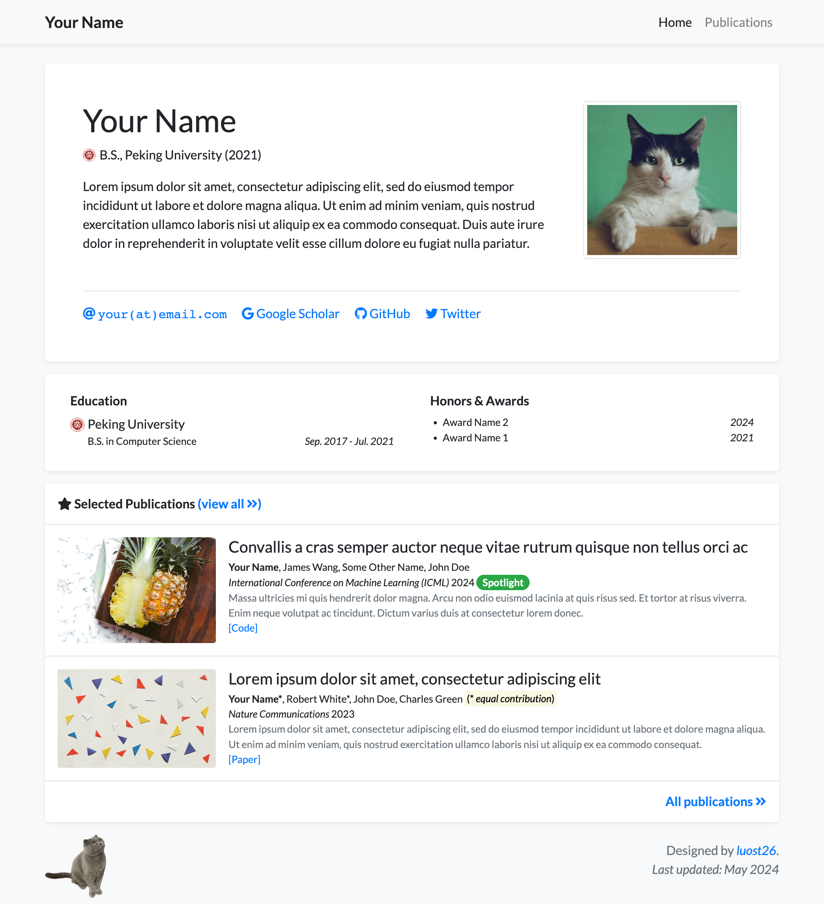
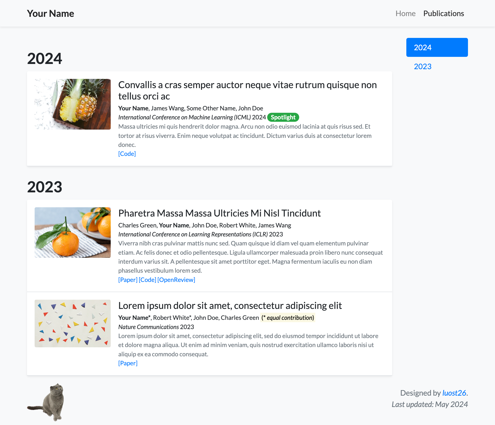
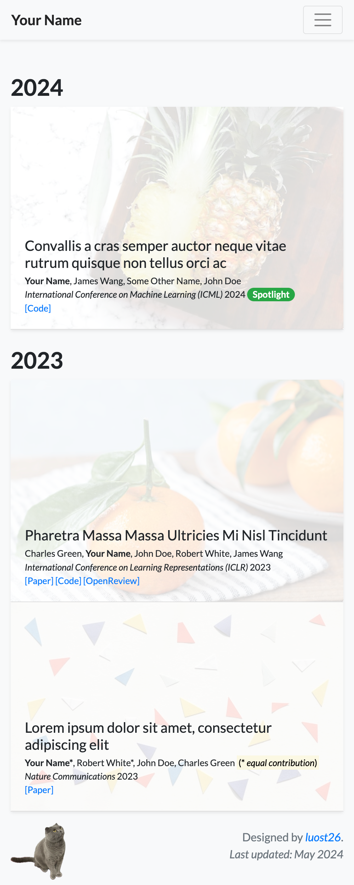

# academic-homepage

This is a GitHub Pages template for personal academic homepages. The template is based on [the creator's homepage](https://luost.me) and [WangRongsheng's version](https://github.com/WangRongsheng/WangRongsheng.github.io).

Click [here](https://luost.me/academic-homepage/) to see the preview of the template.

| Homepage | Publications | Pub. (Mobile) |
| -------- | ------------ | ------------- |
|  |  |  |

 ```geojson
{
  "type": "FeatureCollection",
  "features": [
    {
      "type": "Feature",
      "id": 1,
      "properties": {
        "ID": 0
      },
      "geometry": {
        "type": "Polygon",
        "coordinates": [
          [
              [-77.4286, 39.0481],
              [-77.2085, 39.0481],
              [-77.2085, 38.9343],
              [-77.4286, 38.9343],
              [-77.4286, 39.0481]
          ]
        ]
      }
    }
  ]
}
```

<a href="http://www.clustrmaps.com/map/Nagi.fun" title="Visit tracker for Nagi.fun"></a>